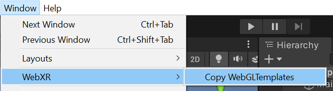
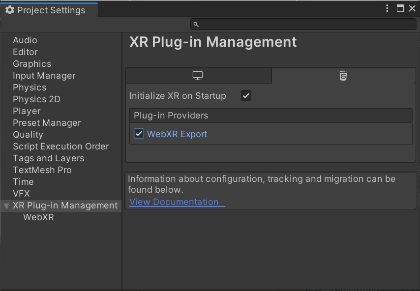
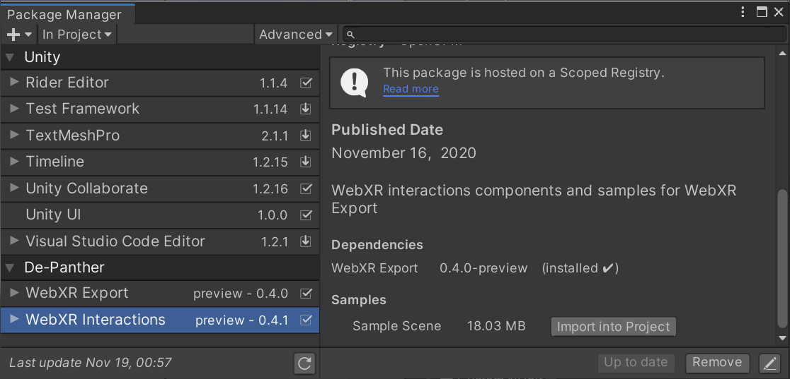
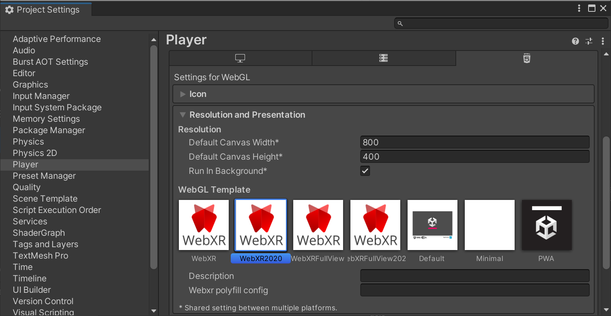
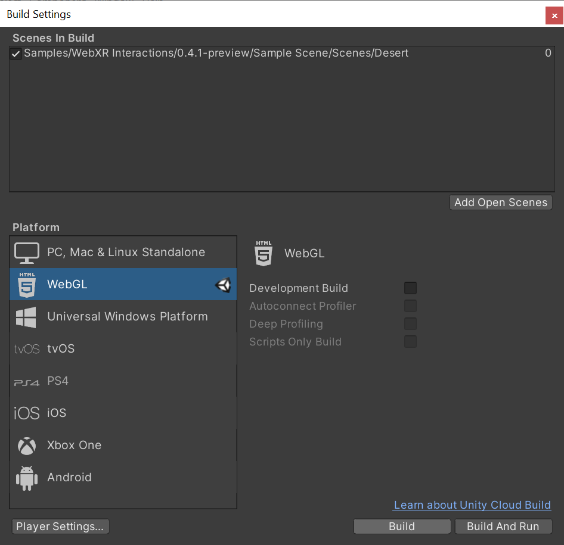
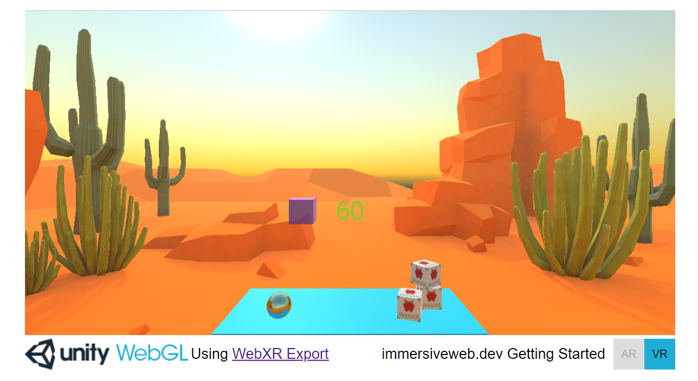

# Getting Started

In this page, we have a step by step guide on how to build a project from the Sample Scene.

## Let's build some WebXR stuff

Create a new Unity Project (2019.4.7f1 and up). Switch platform to WebGL.

Import WebXR Export and WebXR Interactions packages from OpenUPM.
- [WebXR Export ](https://openupm.com/packages/com.de-panther.webxr/)
- [WebXR Interactions ](https://openupm.com/packages/com.de-panther.webxr-interactions/)

Once packages are imported, Go to `Window > WebXR > Copy WebGLTemplates`.

After `WebGLTemplates` are in the `Assets` folder, Open the `XR Plug-in Management` tab in the `Project Settings` window and select the `WebXR Export` plug-in provider.

Now you can import the `Sample Scene` from `Window > Package Manager > WebXR Interactions > Sample Scene > Import into Project`.

In `Project Settings > Player > Resolution and Presentation`, select `WebXR` as the `WebGL Template`. (If you are using Unity 2020.x and up you should use the 2020 templates)

Now you can build the project.

WebXR requires a secure context (HTTPS server or localhost URL). Make sure to build the project from `Build Settings > Build`. Unity's `Build And Run` server use HTTP. Run the build on your own HTTPS server.

That's it.
