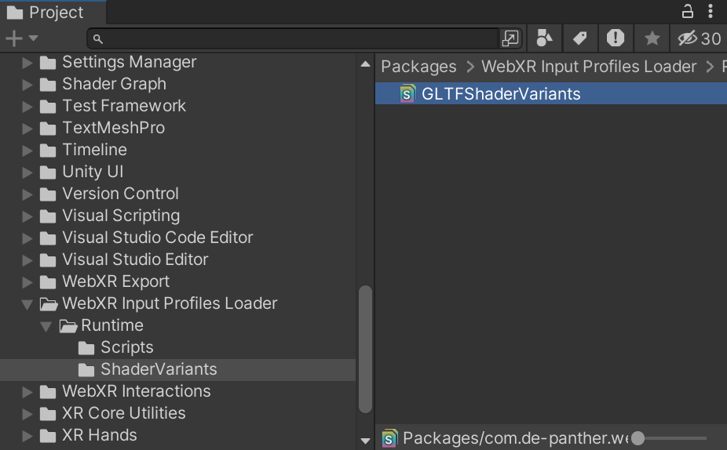
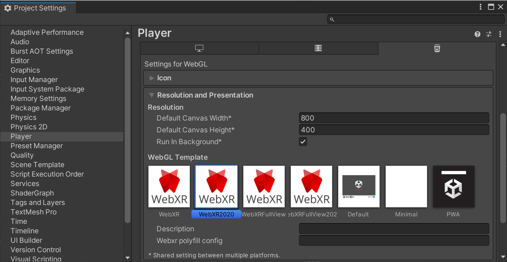

# Using XR Interaction Toolkit

A quick guide on using XR Interaction Toolkit with WebXR Export.

> [!IMPORTANT]
> Since version 0.20.0 of WebXR Export, there's no support for Built-in Render Pipeline, use URP.

## Sample Scene

As part of the WebXR Interactions package, there's the "XR Interaction Toolkit Sample", import it using the Package Manager window.
The sample will notify about missing packages and samples from those packages, using the Project Validation settings window.
Once all needed packages and samples are imported, the project will have "WebXRInteractionToolkit" scene, and prefabs for XR Rig and XR Setup.
The main difference between XR Interaction Toolkit basic XR Rig to the WebXR XR Rig, is the use of more than one Camera object.

## Project Settings

Make sure that in player settings, `Active Input Handling` is set to `Both` or `Input System Package (New)`.
In the `Input System Package` settings, `Background Behavior` should be set to `Ignore Focus`.

## Notes

The support for XR Interaction Toolkit was added using Unity 2022.3.10f1 and tested mainly on this version.
The support was built in a way that it'll be possible to use the OpenXR package in editor mode. For that the OpenXR package should be set up in the XR Plug-in Management window.
Notice that the `CameraMain` is using the old `Tracked Pose Driver` instead of the one of the Input System package, due to a bug. It will create issues when using "XR Interaction Toolkit - XR Device Simulator". On those cases, you can add the new component and disable the old one when in editor.
Notice that the XR Device Simulator won't work if OpenXR is enabled and the Interaction Profiles list in the OpenXR settings is not empty.

## Getting Started - XR Interaction Toolkit Sample

Create a new Unity Project (2022.3.10f1 and up). Switch platform to WebGL.

Import WebXR Export and WebXR Interactions packages from OpenUPM.
- [WebXR Export ](https://openupm.com/packages/com.de-panther.webxr/)
- [WebXR Interactions ](https://openupm.com/packages/com.de-panther.webxr-interactions/)

If you want to use WebXR Input Profiles to display the device controllers models, also add the WebXR Input Profiles Loader package.
- [WebXR Input Profiles Loader ](https://openupm.com/packages/com.de-panther.webxr-input-profiles-loader/)

Simplest way to do it is to set a `Scoped Registry` in `Project Settings > Package Manager` for OpenUPM.

```
Name: OpenUPM
URL: https://package.openupm.com
Scope(s): com.de-panther
          com.atteneder
```

The `com.atteneder` is needed when using the WebXR Input Profiles Loader package.


Import the packages in the Package Manager window.


Import the XR Interaction Toolkit package. It might ask to re-open the project when it imports the Input System package.


Once Imported all the packages, import the `XR Interaction Toolkit Sample` from the WebXR Interactions package.


If some dependencies are missing, the `Project Validation` will open, click `Fix` on every issue and wait for it to be fixed before clicking on the next `Fix`.


Open the XR Interaction Toolkit sample scene at `Assets/Samples/WebXR Interactions/VERSION/XR Interaction Toolkit Sample/Scenes`


Copy WebGLTemplates from the WebXR Export package, Go to `Window > WebXR > Copy WebGLTemplates`.


After `WebGLTemplates` are in the `Assets` folder, Open the `XR Plug-in Management` tab in the `Project Settings` window and select the `WebXR Export` plug-in provider.


Set `Background Behavior` to `Ignore Focus` in the `Input System Package` settings in the `Project Settings` window. That would make sure that the controllers tracking won't be lost when the browser tab loses focus.


If using the `WebXR Input Profiles Loader`, locate the `GLTFShaderVariants`.



Add the `GLTFShaderVariants` to the `Preloaded Shaders` list in the Graphics settings window.


In `Project Settings > Player > Resolution and Presentation`, select `WebXR2020` or `WebXRFullView2020` as the `WebGL Template`. (The WebXR templates with no year number are for older versions)

> [!NOTE]  
> In WebXR Export version 0.20.0 old templates removed, now there are only 2020 templates.



Now you can build the project.


WebXR requires a secure context (HTTPS server or localhost URL). Make sure to build the project from `Build Settings > Build`. Unity's `Build And Run` server uses HTTP. Run the build on your own HTTPS server.

> [!NOTE]  
> Use HTTPS server.


That's it.
