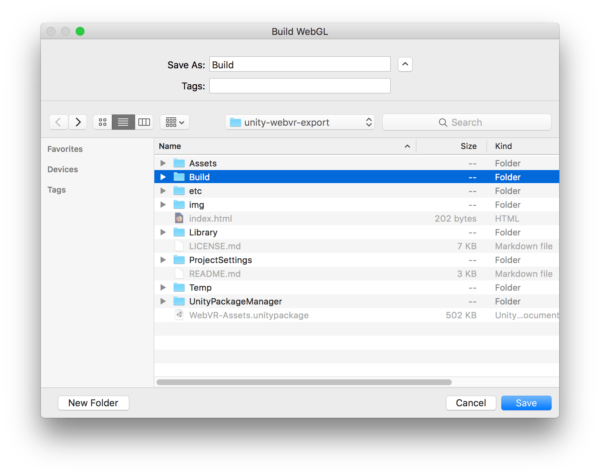
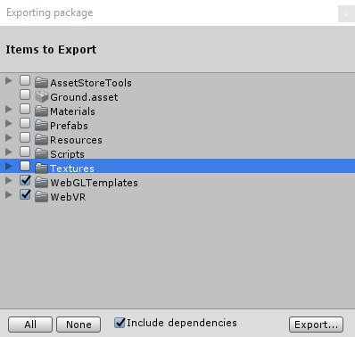
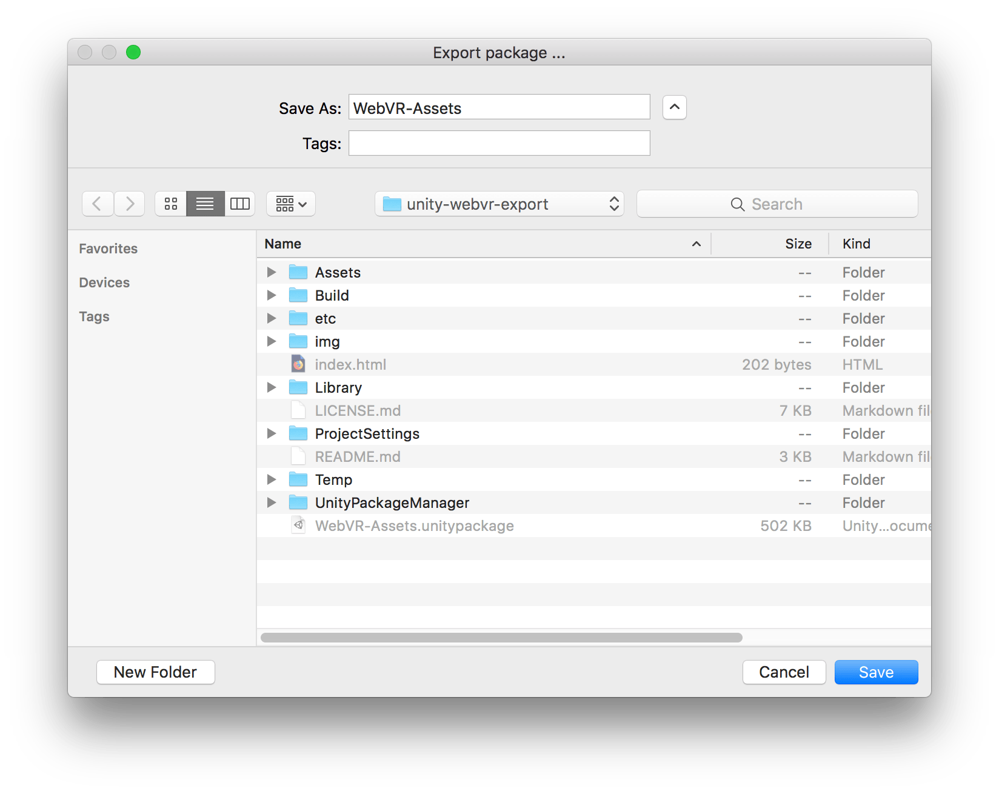

# Building the Unity Assets Package

If you are a maintainer of this project, and you modified the demo scene distributed with the package, you will want to update the [`Build/` directory](https://github.com/mozilla/unity-webvr-export/tree/master/Build/) (hosted [online here](https://mozilla.github.io/unity-webvr-export/Build/)).

1. Launch `Edit > Build Settings > Project Settings`. From `Player Settings…` (`Edit > Project Settings > Player`), select the **`WebGL settings`** tab (HTML5 icon), toggle the **`Resolution and Presentation`** view, and select **`WebVR`** for the `WebGL Template`.

    

2. Launch `Edit > Build Settings > Project Settings`. Then, press the **`Build and Run`** button, and **`Save`** to the directory named **`Build`**.

    

If you are contributing to the Assets, you can build and export a new version of the [`WebVR-Assets.unitypackage` file](../WebVR-Assets.unitypackage).

Notice that the package does not include all the assets in the repository but **only those under `WebVR` and `WebGLTemplates`**:

1. Open **`Assets > Export Package…`**. A window titled `Exporting package` will appear. Press the **`Export…`** button to proceed.

    

2. When prompted for the file location, set **`WebVR-Assets`** as the filename of the destination Unity Asset Package, and press the **`Save`** button.

    
