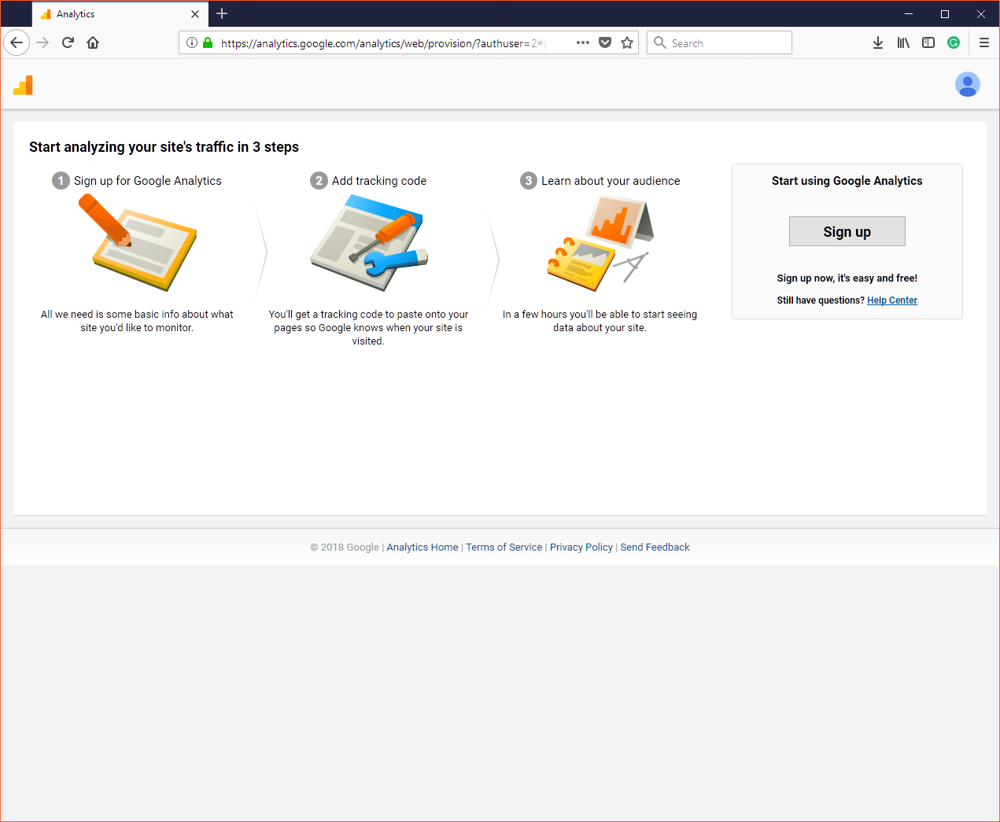
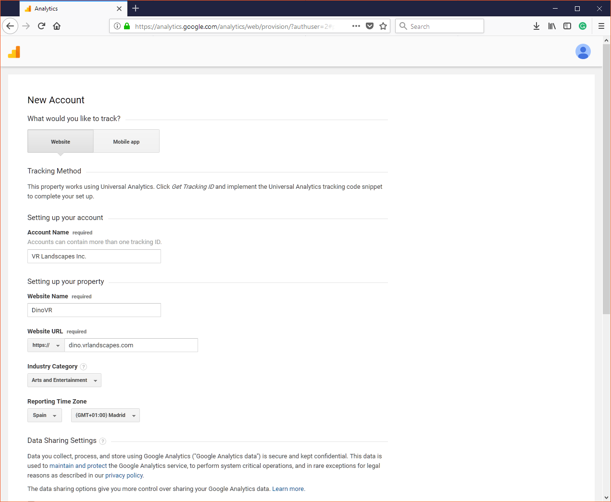
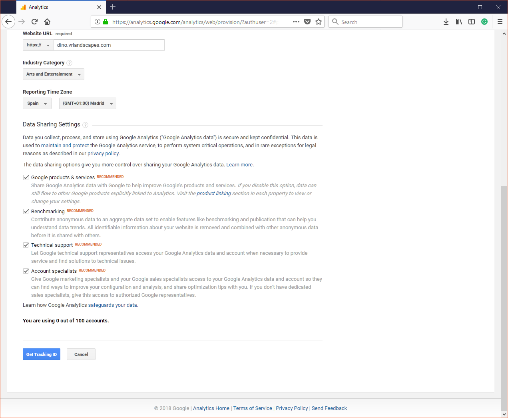
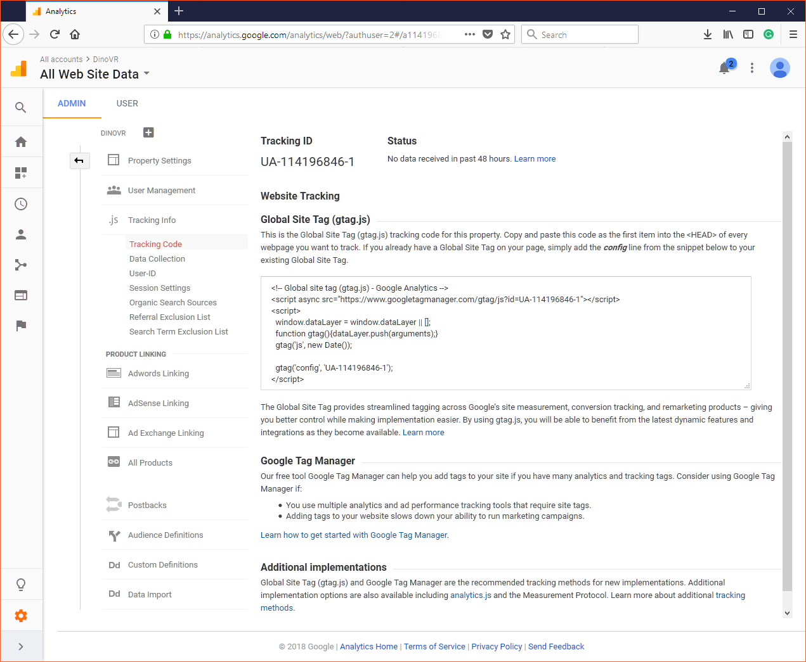
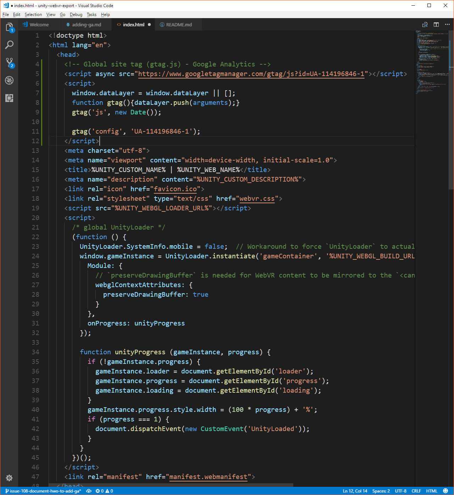

# How to add Google Analytics to your game

Google Analytics is a popular web analytics service that tracks and reports website traffic. It offers insight about your user behaviour and allows you to make informed decisions regarding the evolution of your site.

The [VR template](../../Assets/WebGLTemplates/WebVR/index.html) that comes with the [Unity package](https://u3d.as/1476) already includes Analytics as a part of the telemetry library used for [collecting usage data](../data-collection.md) but you'll need to set up a Google Analytics account and get a [tracking Id](https://support.google.com/analytics/answer/7372977) first, before using it.

## Quick set up

Start by visiting [Google Analytics](https://analytics.google.com/analytics/web) and sign up for a new account:



Fill in the details of your organization and website. Remember to select `https://` in the drop-down menu of the `Website URL` field.



When you finish, click on `Get Tracking ID` at the bottom of the page:



This will redirect you to the configuration page where you find the HTML code you need to use in the template:



**Don't use the snippet above**. Instead, with your favourite code editor, open the file at `Assets/WebGLTemplates/WebVR/index.html` and paste the following code after including the `telemetry.js` library, preferably at the bottom of the `<head>` tag:

```html
<script>
  var ga = MozillaResearch.telemetry.ga.create('UA-XXXXXXX-Y');
  ga('send', 'pageview');
</script>
```



### Template integration of Google Analytics

If you have used Google Analytics before, the previous code should remind you of the familiar Analytics snippet:

```js
ga('create', 'UA-XXXXXX-Y', 'auto');
ga('send', 'pageview');
```

When using Analytics inside the template, use the `create` method of `MozillaReasearch.telemetry.ga` instead of the `create` command. It will return a tracking function which can be used in the same way you would use it in the guide [Sending Data to Google Analytics.](https://developers.google.com/analytics/devguides/collection/analyticsjs/creating-trackers) 

```js
var ga = MozillaResearch.telemetry.ga.create('UA-XXXXXX-Y', 'auto');
ga('send', 'pageview');
```

If you want to customize the way you create the tracker, read [Creating Trackers](https://developers.google.com/analytics/devguides/collection/analyticsjs/creating-trackers) and remember that:

```js
ga('create', arg1, arg2, ...);
``` 

Is equivalent to:

```js
var ga = MozillaResearch.telemetry.ga.create(arg1, arg2, ...);
```

## Using Google Analytics

The amount of data in Google Analytics can be overwhelming to navigate and dissect. Fortunately, the folks at Google have developed a series of courses to explain you the main concepts of traffic analysis. We recommend you start at [Google Analytics Academy](https://analytics.google.com/analytics/academy/). 

## Open-source alternatives

There are a few [open-source alternatives](https://en.wikipedia.org/wiki/List_of_web_analytics_software#Free_/_Open_source_(FLOSS)) out there. Like Google Analytics, they are free although you need to host them yourself. We recommend [Matomo](https://matomo.org/) and [Open Web Analytics](http://www.openwebanalytics.com) (OWA). Both offer geolocation, click-heat maps, traffic by referrer, event tracking, etc. Which specifically depends on your needs but you can compare both side by side visiting the [demo pages for Matomo](https://demo.matomo.org) and [OWA](http://demo.openwebanalytics.com/owa/). 