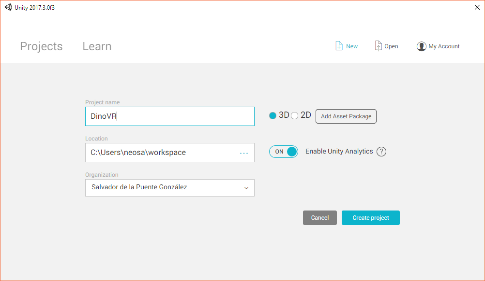
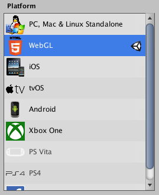
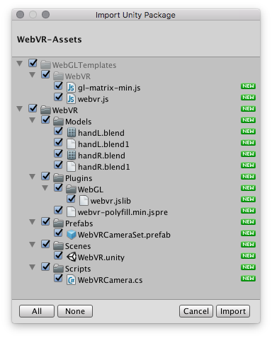
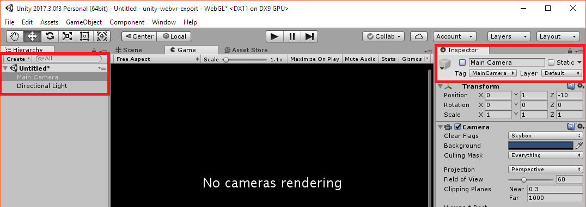
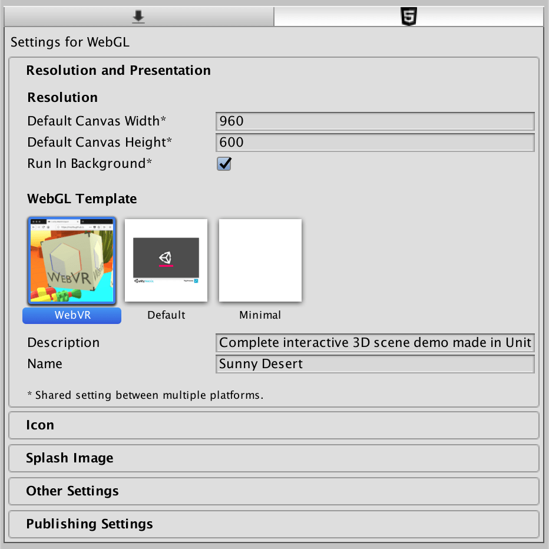

# Setting up a Unity project for WebVR

In this tutorial, we go through the steps of a basic project setup using the WebVR Assets.

## 1. Create a new Unity 3D project.

Open an existing project, or click on the `New` button and fill in the details of the new game:



## 2. Ensure that WebGL platform support is installed.

Open the menus: `File > Build Settings`



## 3. Import the WebVR assets to your project.

Download the Unity package from GitHub: [`WebVR-Assets.unitypackage`](https://github.com/mozilla/unity-webvr-export/raw/master/WebVR-Assets.unitypackage)

Import the package into your project:

```
Assets > Import Package > Custom Package
```



## 4. Disable the classical camera and add the WebVR camera.

Select `Main Camera` from the scene's `Hierarchy`; then, disable the camera from the `Inspector`.



Add the `WebVRCameraSet` prefab (`Assets > WebVR > Prefabs > WebVRCameraSet.prefab`), and optionally the hand-controller models to your scene from the `WebVR > Models` folder:


## 5. Add controller models to `WebVRCamera` component.

Set up `GameObject`s that you would like to be used for left/hand controllers by attaching them to the `WebVRCameraSet` component `Left Hand Obj` and `Right Hand Obj` fields.


## 6. Select the WebVR template from player settings.

Go to `Edit > Project Settings > Player`:



## 7. Build and run your project!

Click on `File > Build & Run`, select a destination folder and Unity will compile your code and and launch the game in your **default** browser. If you want to open the game in another browser, copy and paste the URL of the game.

Under the hood, when clicking `Build & Run`, Unity will place all the needed files in the selected folder and will spin up a development web server pointing there. If you want to provide your own server, choose `File > Build` instead.

## 8. Adapt your game.

You will probably need to adapt your game mechanics and camera behaviours to integrate with WebVR. Good luck!
