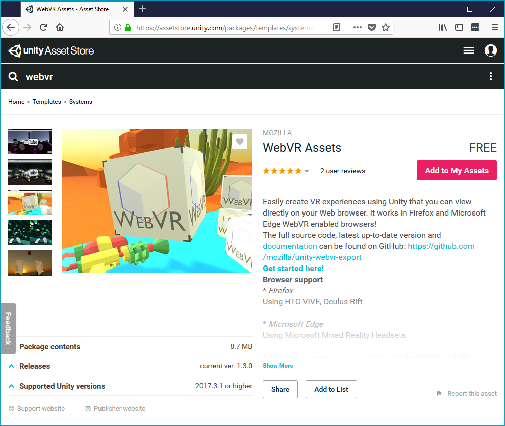
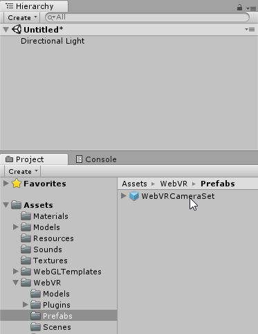
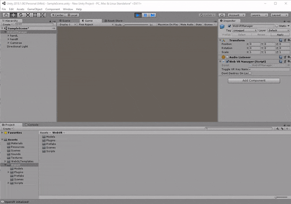

# Setting up a Unity project for WebVR

In this tutorial, we go through the steps of a basic project setup using the WebVR Assets.

## 1. Create a new Unity 3D project.

Open an existing project, or click on the `New` button and fill in the details of the new game:

## 2. Ensure that WebGL platform support is installed.

Open the menus: `File > Build Settings`

## 3. Download the assets from the Unity Asset store.

**[Unity Asset Store page](https://assetstore.unity.com/packages/templates/systems/webvr-assets-109152).**

Alternatively, download and install the [`WebVR-Assets.unitypackage`](https://github.com/mozilla/unity-webvr-export/raw/master/WebVR-Assets.unitypackage) from this repo and use (`Assets > Import Package > Custom Package`) to import the package into your project.

## 4. Add the WebVR prefab to your scene.

Disable the standard default camera, so that it does not interfere with the cameras used in the WebVR prefab.

To do this, select `Main Camera` from the scene's `Hierarchy`; then, delete or disable the camera from the `Inspector`.

Add the `WebVRCameraSet` prefab (`Assets > WebVR > Prefabs > WebVRCameraSet.prefab`):

The prefab contains hand controllers, VR Camera setup and other components needed for your game to work with WebVR. 

## 5. You're Unity project is setup. Play to see the result!

## 6. Build your project to WebVR

### Select the WebVR template from player settings.

Go to `Edit > Project Settings > Player`:

### Build and run your project in the browser!

Click on `File > Build & Run`, select a destination folder and Unity will compile your code and and launch the game in your **default** browser. If you want to open the game in another browser, copy and paste the URL of the game.

Under the hood, when clicking `Build & Run`, Unity will place all the needed files in the selected folder and will spin up a development web server pointing there. If you want to provide your own server, choose `File > Build` instead.

