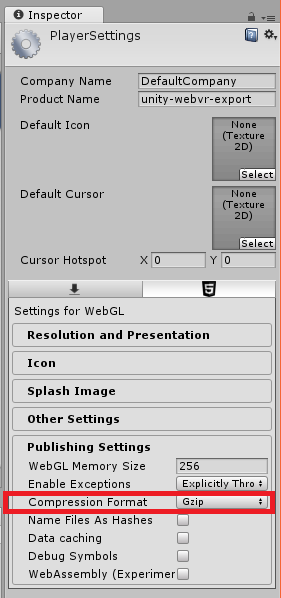

# Publishing

Publishing on the Internet is not different from publishing a blog or the landing page of your game. Actually, with a web-based game you could embed the game in your site, putting it just one-click away from your players! No stores, no approvals, no installations... [on compatible browsers](../README.md#compatibility), they just work.

## Choosing a static web server

Unless you use your own machines, it is likely you want to use a free hosting service. The main limit you'll find with free-hosting are restrictions over file-size, type and bandwidth. WebVR exports propietary formats for packaged assets and those can be heavy (from few megabytes to several hundreds).

This document assumes you have already exported your game with Unity, targeting WebGL and using the WebVR template that comes with the assets package. To know how to export your project for WebVR, please refer to [Setting up a Unity project for WebVR](./project-setup.md).

### Deploying on GitHub

A good choice is using [GitHub Pages](https://pages.github.com/). If your exported game folder [meets the constraints](https://help.github.com/articles/what-is-github-pages/#usage-limits), you can convert it into a `git` repository and publish it. Refer to [Create a repo](https://help.github.com/articles/create-a-repo/) and [Configuring a publishing source for GitHub Pages](https://help.github.com/articles/configuring-a-publishing-source-for-github-pages/#enabling-github-pages-to-publish-your-site-from-master-or-gh-pages) to find out how to create and publish your game.

### Exceeding bandwidth restrictions

When targeting a production release, don't forget to [GZIP your assets](https://docs.unity3d.com/Manual/webgl-deploying.html).

Even if your files are not that big, we hope you'll be successful and attract tons of users to your game. That means potentially thousands of gigabytes being downloaded per month. We are working on improving the template to [save as much bandwidth as possible](https://github.com/mozilla/unity-webvr-export/issues/98) but eventually, you'll exceed bandwidth limits. If that's the case, consider using a CDN or get a paid hosting plan. There are [very good and inexpensive plans out there](http://www.turiyaware.com/finding-the-right-hosting-for-indie-game-developers/).

#### Integrating with a CDN

[CDNs have become more and more relevant](https://www.keycdn.com/blog/cdn-for-gaming/) for gaming. First there is a huge offer on the Internet. There are tons of configurations and you should consider one fast and reliable. Check out this [techradar.pro comparison](http://www.techradar.com/news/the-best-cdns-of-2018) to get a starting point.

Refer to the section `Moving build output files` from Unity's [WebGL building documentation](https://docs.unity3d.com/Manual/webgl-building.html) to learn how to configure the template to work with an external CDN.
