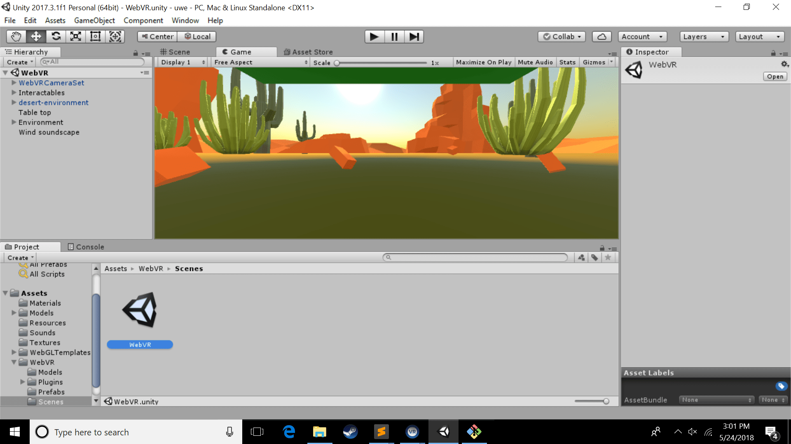

# Enabling Virtual Reality player mode in Unity's XR Editor

## XR Settings

For rapid testing in your headset, you can enable Virtual Reality support in your [Unity project](./project-setup.md).

1. Select the **`File > Build Settings…`** menu option from the top-level Unity application menu.
2. When the pop-up window appears, select to highlight the **`PC, Mac & Linux Standalone`** option in the **`Platform`** list. (When you are ready to [build your application for WebVR](./build.md), ensure that **`WebGL`** is still the selected platform.)

    

3. Click the **`Player Settings…`** button at the bottom of the pop-up window. Or you can access the **`Player Settings…`** by selecting the **`Edit > Project Settings > Player`** menu option from the top-level Unity application menu.

    

4. In the **`Inspector`** pane, click the tab for **`Settings for PC, Mac & Linux Standalone`** pane (i.e., the icon with the underlined down arrow), if the tab is not already selected.

    

5. Click on the **`XR Settings`** title to expose the section if it is hidden. Enable the **`Virtual Reality Supported`** checkbox field.

    

6. Notice that are two **`Virtual Reality SDKs`** listed, sorted in the order in which Unity attempts to enable VR devices at runtime or during VR preview:
    - **`OpenVR`** (i.e., for the HTC Vive and Windows Mixed Reality headsets)
    - **`Oculus`** (i.e., for the Oculus Rift and, soon, Oculus Go headsets)

    When building for [WebVR](./build.md), ensure that the **`WebGL`** option is still selected in the **`Platform`** list (**`File > Build Settings…`**).

      
